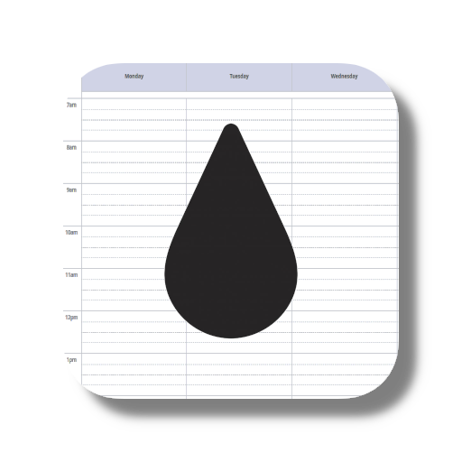
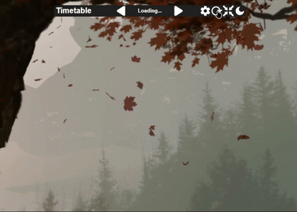
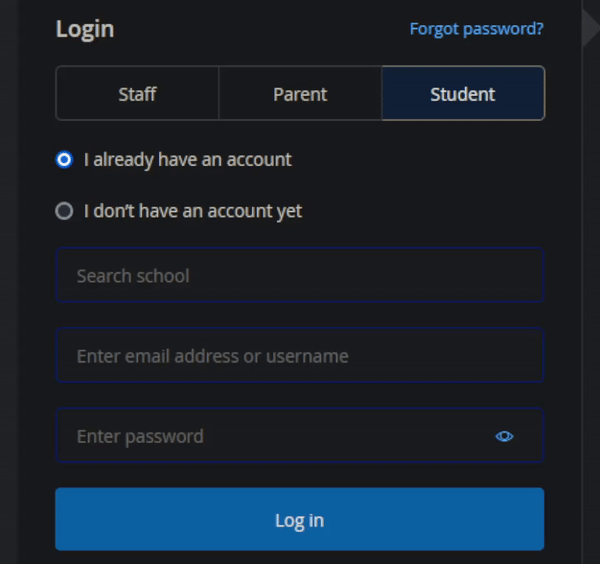
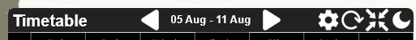

  

  # Rainmeter Timetable

  

  ## Tired of opening up your timetable? ✅

  `Rainmeter Timetable` **automatically** displays your timetable from your school's website (currently only supports [Satchel One](https://www.satchelone.com/)) on your desktop! 📅

  **Make life easy! 💪**

  

  If this helps you, please ⭐ the repository & [follow me](https://github.com/aritra-codes) :D

---

# ⬇️ Installation

You must have [Rainmeter](https://www.rainmeter.net/) installed.

- Click on the latest [release](https://github.com/aritra-codes/rainmeter-timetable/releases/) (under the 'About' section).
- Download the .rmskin file.
- Open the file and install the skin.
- If the skin hasn't loaded automatically:
  - Right-click on the Rainmeter icon in the system tray ("^" near bottom-right of the taskbar)
  - Click on Skins > Rainmeter Timetable > Timetable.ini

---

# 🔄 Updating

Just follow the installation instructions above.

---

# ⚙️ Setup

- On the skin, click on the Settings (⚙️) button (or load Settings.ini) to go to the settings.
- You need to enter your school (as written in Satchel One), username **or** email and password:
  - To find out your username/email and password:
    - Go to [Account Settings](https://www.satchelone.com/account-settings) in Satchel One.
    - You can see your username and email in the "My details" section at the top.
    - If you haven't set your password or forgotten your password, create a new password in the "Change your password" section.
  - To find out your exact school name:
    - Go to the [Log In](https://www.satchelone.com/login) page in Satchel One.
    - Start typing your school name and once it auto-completes to the correct school, copy it.
    
- After saving your settings, click on the Return button (at the top-right) to go back to the main menu.
- Click on the Refresh button (🔄) to show today's timetable.
---

# 🖱️ Usage

Image controls:

- To zoom in and out, use the scroll wheel.
- To move around the image, hold down the middle mouse button and drag.

Toolbar (from left to right):

- **Title**: To change the title, click on it, type the desired text and press Enter to save (or press Esc to dismiss).
- **Previous week button**: Shows the previous week's timetable.
- **Date**: Displays the date of the timetable.
- **Next week button**: Shows the next week's timetable.
- **Settings button**: Shows the settings.
- **Refresh button**: Shows the current week's timetable.
- **Fit window button**: Zooms out the timetable as much as possible to fit the size of the window.
- **Toggle theme button**: Switches between light and dark theme.

---

# ‼️ Disclaimer
This project is not associated with Satchel One.

If you have any problems with this project, please send me an email at aritra8.codes@gmail.com.
